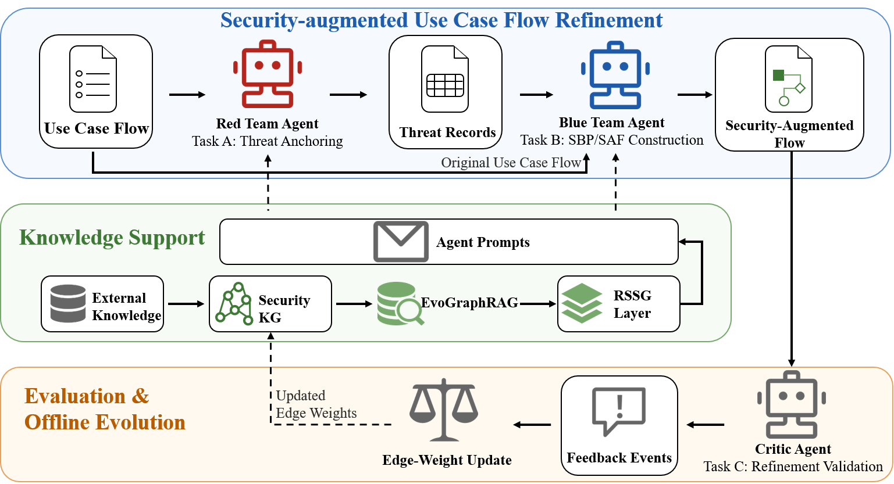
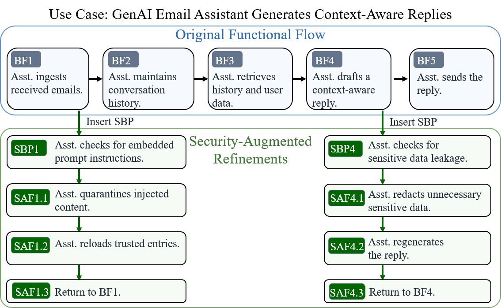

# MA-SAFR

This repository is the paper-aligned replication package for:

> **Security-Augmented Use Case Flow Refinement for LLM-Based Agentic Systems**

It contains the benchmark, prompts, implementation scripts, knowledge assets, and human-validation artifacts directly associated with the manuscript.

## Abstract

Unlike conventional software systems and large language models (LLMs) evaluated in isolation, LLM-based agentic systems introduce a compositional, workflow-level attack surface. Existing security analysis approaches provide limited support for identifying security omissions implicit in functional use case flows and deriving corresponding flow refinements for direct incorporation into use case specifications. We formulate the *Security-Augmented Use Case Flow Refinement Task* and propose *MA-SAFR*, a multi-agent framework that coordinates Red Team, Blue Team, and Critic agents for threat anchoring, security-branch construction, and validation. *EvoGraphRAG* adapts relation-aware retrieval through validation feedback, while Risk-Specific Security Guidance (RSSG) provides risk- and role-specific constraints. To support systematic evaluation of this task, we construct *SAFR-Bench* from OWASP and MITRE ATLAS, comprising 157 cases and 235 source-grounded threat–refinement pairs. Across three generation models, *MA-SAFR* improves all three metrics on average compared with the strongest corresponding baselines; pipeline recall and pipeline precision increase by 63.44% and 54.96%, respectively. Controlled analyses show that RSSG and feedback-based graph evolution within *EvoGraphRAG* improve downstream threat-to-defense conversion. Despite remaining challenges in implicit-threat identification, multi-threat coverage, and defense alignment, the results demonstrate that *MA-SAFR* effectively transforms functional use case flows into valid security-augmented use case flows.

## Figures

### MA-SAFR overview



### Security-augmented use case flow example



## Repository Structure

```text
MA-SAFR/
├── README.md
├── LICENSE
├── requirements.txt
├── .env.example
├── 0_Data/
│   ├── 5_Knowledge_Base/
│   │   ├── source/              # Structured OWASP and MITRE ATLAS knowledge
│   │   ├── recevograph_rag/     # Base relation-aware security graph
│   │   ├── recevograph_rag_evo_v0_2/
│   │   ├── recevograph_rag_feedback/
│   │   └── C2_strict_alpha_v1/ # Frozen graphs for RQ3
│   └── 6_SAAFG/
│       ├── 1_Input_Functional_Flows/
│       ├── 2_RedTeam_Threat_Records/
│       ├── 3_BlueTeam_SA_Flows/
│       ├── 5_Gold_or_Human_Check/
│       ├── 7_Benchmark_Package_v0_2/
│       └── 8_human_validation/
├── 1_Scripts/
│   ├── SAAFG/                   # Benchmark, generation, graph, evaluation, and RQ scripts
│   └── build_vanilla_rag_index.py
├── 3_Prompt/
│   └── SAAFG/                   # Agent, baseline, ablation, and judge prompts
├── assets/
│   └── figures/                 # Figures used in the manuscript
└── results/
    └── paper/                   # Human-validation results retained in the public package
```

